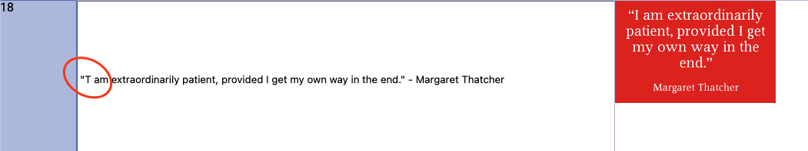

# Data wrangling quotes

I have over the last few years captured screenshots on my phone of quotes from the Economist Espresso news app.

Whatever quote I liked at the time I took a screenshot of, and now I wanted to use those quotes for something.

To do that I needed to get the quotes into a text file, which meant doing a few things:

1. Download all the quotes from Google Photos, and crop out just the quote. These are stored in the quotes folder
2. Use the tesseract command line tool to OCR the images into text, see [quotes/ocr.sh](quotes/ocr.sh)
3. Because OCR isn't perfect, I needed to manually inspect and make some changes..

Point 3 is key for what this repo is about. I've been building [Sigbla](https://github.com/sigbla/sigbla-app/) for a
while now and this is the perfect tool for this task.

After running [quotes/txt.sh](quotes/txt.sh) I have a file named output in the quotes folder. It contains all the
quotes using some ad-hoc structure allowing me to easily separate each quote and refer to the relevant image.

Opening the output file in a text editor and then manually opening each image was just too painful. Instead, I wanted
the image to be shown next to the quote so that I could easily spot any issue and fix it without any
hassle.

That's what the code in the [Quotes.kt](src/main/kotlin/Quotes.kt) file does. Load the output file, fix some common
issues, set up the table and image resources, and save any changes to a Sigbla table file. Then I could simply open
this in my browser and quickly go through each quote and fix any issues in no time.

Here's some typical examples of the issues that need fixing from the OCR process. I can simply edit these in the browser
and have that change be stored in the quotes.sigt file for later use.

Data wrangling is often about stuff like this, a one-off task that just needs to be done as quickly and pain free as
possible, and I'm glad my efforts in making [Sigbla](https://sigbla.app) allowed me to write less than 100 lines of
code to aid in that.
